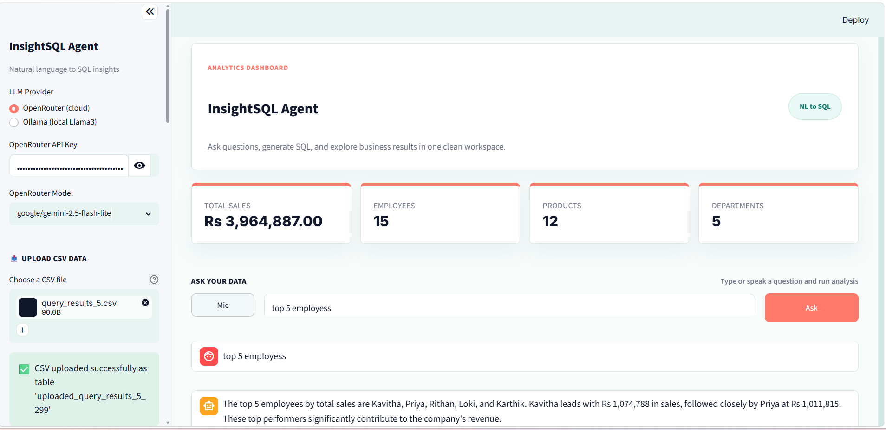
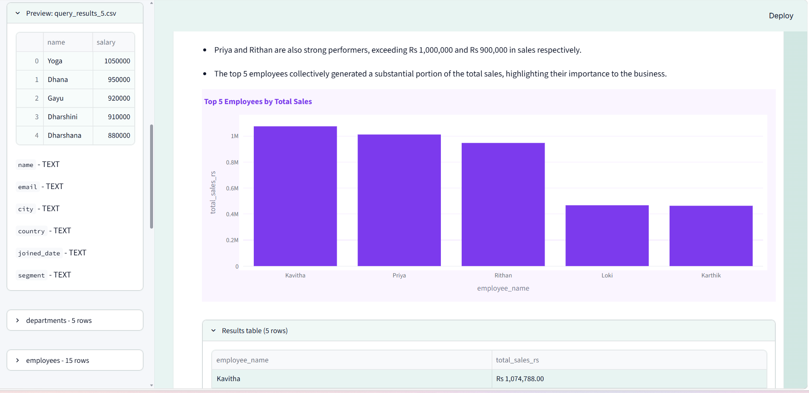
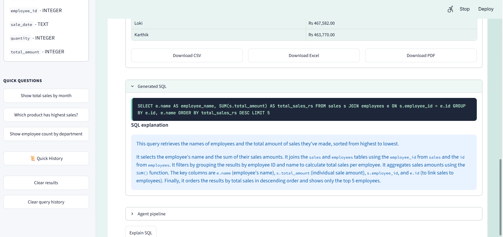
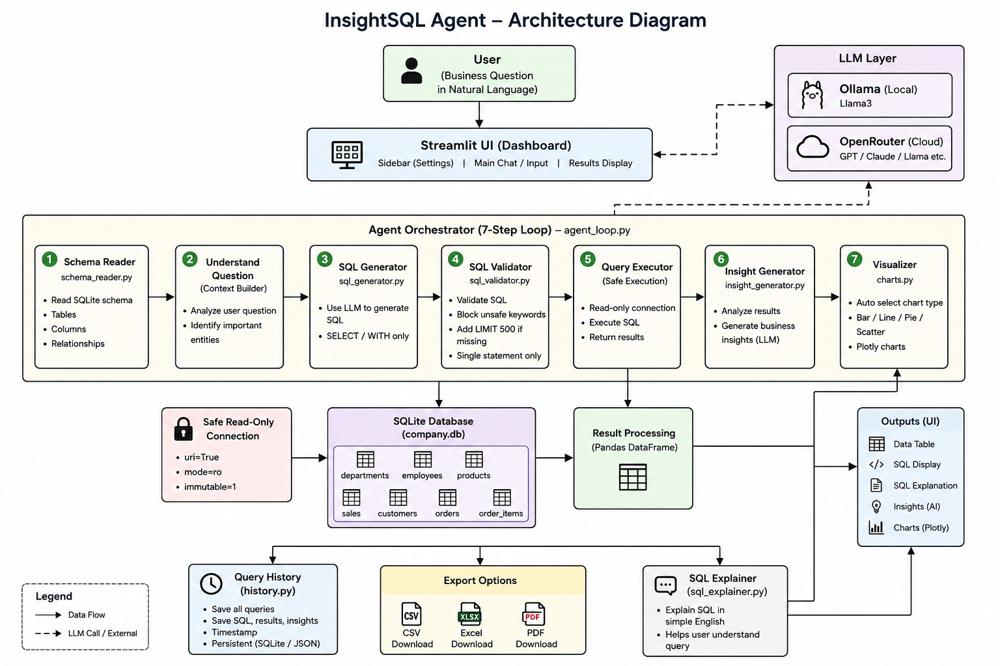

# InsightSQL Agent

** NL-to-SQL Analytics Agent** - Ask business questions in plain English, get safe SQL, interactive charts, and AI-powered insights. Built with Python, Streamlit, SQLite, and Llama3 (Ollama) or OpenRouter.

<p align="center">
  
  
  
  
</p>

## Project Screenshots

<p align="center">
  
  
  
</p>
---

##  System Architecture

The InsightSQL Agent follows a secure 7-step workflow to convert natural language questions into SQL queries, execute them safely, and generate business insights.

<p align="center">
  
</p>
---
## Features

| Feature | Description |
|---------|-------------|
| **7-step agent loop** | Schema -> Understand -> SQL -> Validate -> Execute -> Analyze -> Visualize |
| **Security-first SQL** | Read-only SELECT/WITH only; blocks DROP, DELETE, UPDATE, INSERT, ALTER, TRUNCATE |
| **LLM support** | Ollama for local Llama3 or OpenRouter for cloud models |
| **Auto charts** | Plotly bar, line, pie, and scatter charts based on result shape |
| **Query history** | Persistent log plus CSV export of past queries |
| **Download results** | CSV, Excel, and PDF downloads for query results |
| **Explain SQL** | Plain-English explanation for generated SQL |


---

## How it works

1. User asks: "Show total sales by month"
2. Agent reads the SQLite schema
3. SQL is generated by the selected LLM (Ollama or OpenRouter)
4. SQL is validated and executed safely
5. Results appear as a table, chart, insights, and downloadable files
6. Query history is saved for review and export

---

## Tech stack

- **Frontend:** Streamlit with custom dashboard styling
- **Database:** SQLite (`database/company.db`)
- **AI:** Ollama Llama3 or OpenRouter
- **Analytics:** Pandas and Plotly
- **Testing:** pytest

---

## Project structure

```text
Infinite/
|-- app.py
|-- config/
|   `-- constants.py
|-- agents/
|   |-- agent_loop.py
|   |-- schema_reader.py
|   |-- sql_generator.py
|   |-- sql_validator.py
|   |-- insight_generator.py
|   `-- llm_client.py
|-- ui/
|   |-- styles.py
|   `-- components.py
|-- utils/
|   |-- database.py
|   |-- charts.py
|   |-- formatting.py
|   |-- history.py
|   |-- sql_explainer.py
|   `-- errors.py
|-- prompts/
|   |-- sql_prompt.txt
|   `-- insight_prompt.txt
|-- database/
|   |-- company.db
|   `-- sample_data/
|-- tests/
|-- requirements.txt
|-- README.md
|-- AI_USAGE.md
`-- .env.example
```

---

## Quick start

### 1. Install

```bash
git clone <your-repo-url>
cd Infinite
python -m venv .venv
.venv\Scripts\activate
pip install -r requirements.txt
```

### 2. LLM setup

Choose **Ollama (local)** or **OpenRouter (cloud)** in the sidebar.

For Ollama:

```bash
ollama pull llama3
```

For OpenRouter:

```powershell
Copy-Item .env.example .env
$env:OPENROUTER_API_KEY = "sk-or-v1-your-key"
```

Get a key at [openrouter.ai/keys](https://openrouter.ai/keys).

### 3. Run

```bash
streamlit run app.py
```

Open **http://localhost:8501**.

---

## Sample questions

- Show total sales by month
- Which product has highest sales?
- Show employee count by department
- Top 5 salespeople by revenue in Rs
- Average sale amount by product category
- Monthly sales trend in 2024
- Which department has the highest average salary?
- List sales made by Priya
- Compare Electronics vs Furniture revenue
- How many employees joined each year?
- Top 5 customers by completed order revenue
- Count of customer orders by status
- Products with low stock under 20

---

## Sample data

| Table | Description |
|-------|-------------|
| `departments` | Engineering, Sales, Marketing, HR, Finance |
| `employees` | 15 employees with Tamil names |
| `products` | 12 products with prices and stock quantities |
| `sales` | 35 sales transactions in 2024 |
| `customers` | 10 customer accounts by country and segment |
| `orders` | 20 sample customer orders with status and totals |
| `order_items` | Line items connecting orders to products |

---

## Run tests

```bash
pytest tests/ -v
```

Expected: all tests pass without network access.

---

## Security

- Only `SELECT` and `WITH` queries are permitted
- Mutating SQL keywords are blocked
- SQLite is opened through a read-only connection for query execution
- Unbounded queries automatically receive `LIMIT 500`
- Multiple statements are rejected

---

## Environment variables

| Variable | Description |
|----------|-------------|
| `OPENROUTER_API_KEY` | OpenRouter API key |
| `OPENROUTER_MODEL` | Default cloud model |
| `OLLAMA_BASE_URL` | Ollama server, default `http://localhost:11434` |
| `DEBUG` | Show stack traces in the UI |

Copy `.env.example` to `.env` for local config.

---
